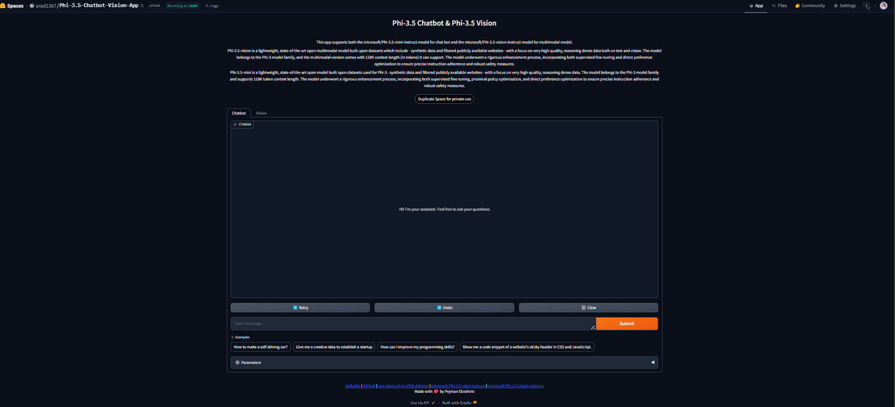

# Phi-3.5 Chatbot & Vision App

* This is a chatbot and multimodal model app built using the powerful models from Microsoft, `microsoft/Phi-3.5-mini-instruct` and `microsoft/Phi-3.5-vision-instruct`. The app supports both chatbot and multimodal model functionalities, allowing you to interact with the models in different ways.

## Deployment on Hugging Face

To deploy the app on Hugging Face, follow these steps:

1. Upload the `app.py` and `requirements.txt` files to your Hugging Face space.
2. The app will be automatically deployed on Hugging Face.

You can access the deployed app at the following link: [Link to Hugging Face app]

## Local Deployment

To run the app locally, follow these steps:

1. Clone the project repository.
2. Install the required dependencies by running `pip install -r requirements.txt`.
3. Make sure you have a GPU available, as the app requires GPU for running the models.
4. Remove the `import spaces` line and the `@spaces.GPU()` decorator from the code.
5. Run the app by executing `python app.py`.

## Possible error
- Ensure that the spaces package is imported before any CUDA-related operations or imports

## Links

- [Link to Hugging Face app](https://huggingface.co/spaces/arad1367/Phi-3.5-Chatbot-Vision-App)
- [Link to GitHub repository](https://github.com/arad1367/Phi-3.5-Chatbot-Vision-App)
- [Link to microsoft/Phi-3.5-mini-instruct model](https://huggingface.co/microsoft/Phi-3.5-mini-instruct)
- [Link to microsoft/Phi-3.5-vision-instruct model](https://huggingface.co/microsoft/Phi-3.5-vision-instruct)

## Acknowledgements

A big thank you to Hugging Face for their easy deployment platform, Gradio for their SDK and themes, and Microsoft for their practical models.

## Contact
- Pejman Ebrahimi, email: `pejman.ebrahimi77@gmail.com`